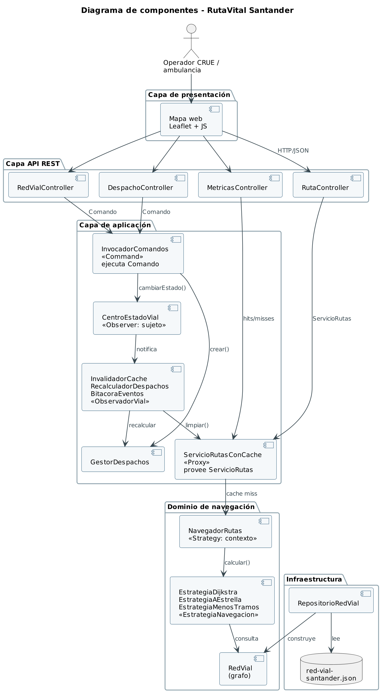
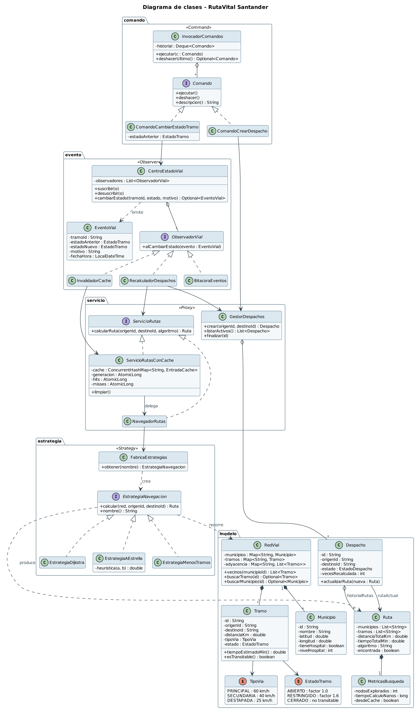
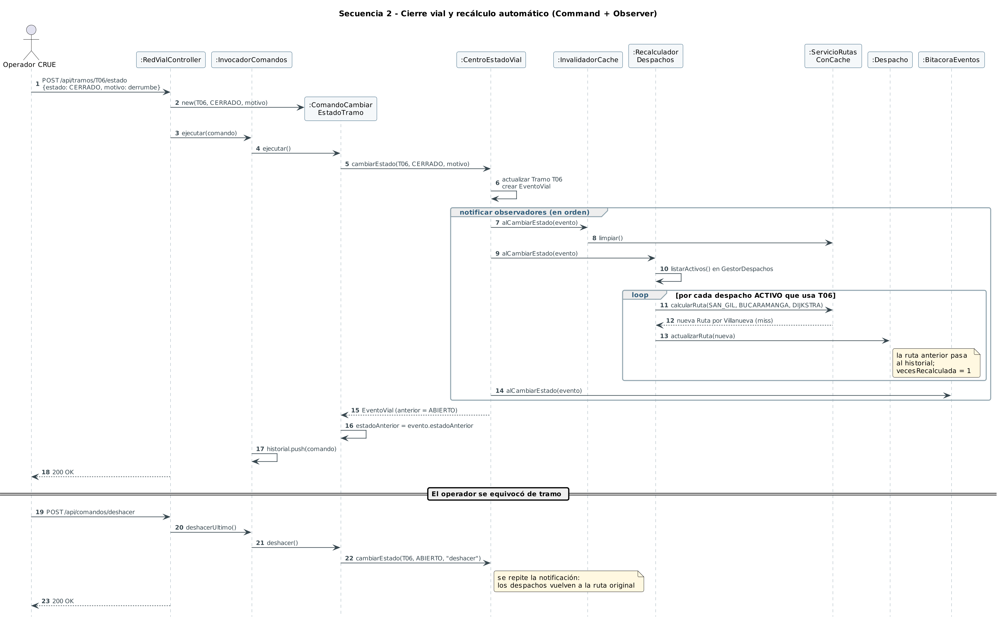

# Diagramas UML

Fuentes en PlantUML (`.puml`) con su imagen renderizada (`.png`). Numeración igual a la del informe.

| Diagrama | Fuente | Imagen |
|---|---|---|
| Red vial modelada | `generar-red-vial.py` | [00-red-vial.png](00-red-vial.png) |
| Componentes (capas) | [01-componentes.puml](01-componentes.puml) | [01-componentes.png](01-componentes.png) |
| Clases | [02-clases.puml](02-clases.puml) | [02-clases.png](02-clases.png) |
| Secuencia: consulta de ruta (Proxy + Strategy) | [03a-secuencia-consulta.puml](03a-secuencia-consulta.puml) | [03a-secuencia-consulta.png](03a-secuencia-consulta.png) |
| Secuencia: cierre vial y recálculo (Command + Observer) | [03b-secuencia-cierre.puml](03b-secuencia-cierre.puml) | [03b-secuencia-cierre.png](03b-secuencia-cierre.png) |
| Actividad: despacho con navegación adaptativa | [04-actividad.puml](04-actividad.puml) | [04-actividad.png](04-actividad.png) |
| Máquina de estados del tramo | [05-estados-tramo.puml](05-estados-tramo.puml) | [05-estados-tramo.png](05-estados-tramo.png) |
| Patrones, uno por diagrama | [patrones/](patrones/) | `p-strategy.png`, `p-proxy.png`, `p-observer.png`, `p-command.png` |







## Cómo regenerarlos

```bash
# Diagramas PlantUML (requiere Java y plantuml.jar)
java -jar plantuml.jar -tpng docs/uml/*.puml docs/uml/patrones/*.puml

# Mapa de la red vial (requiere Python 3 y matplotlib)
cd docs/uml && python3 generar-red-vial.py
```

`estilo.iuml` y `patrones/base.iuml` definen el estilo común.
